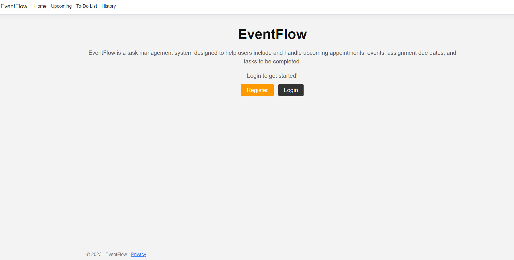

# EventFlow

<h2>What is EventFlow?</h2>

EventFlow is a task management system designed to help users include and handle upcoming appointments, events, assignment due dates, and tasks to complete. Users can assign dates and priority levels to upcoming events, and the application will then arrange each event based on their upcoming dates or priority levels. This platform also allows users to create accounts and log in, enabling them to monitor upcoming events and utilize the to-do list feature for tasks like grocery shopping or pending homework.

<h2>Technical Overview:</h2>

EventFlow is a web application developed using C#, ASP.NET Core, HTML/CSS, and Bootstrap. It connects to a database by effectively utilizing Entity Framework Core and Microsoft SQL Server for data management. By implementing the MVC (Model-View-Controller) design pattern, EventFlow coordinates smooth interactions between the frontend and backend components. 

